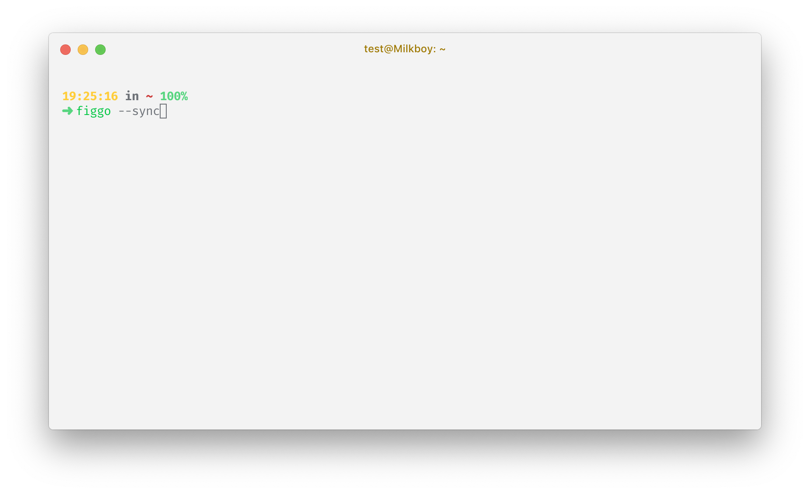

<h1 align="center">Figgo</h1>
<p align="center">A CLI tool make your design tokens always stay up to date with your Figma design styleguide</p>



## Install Figgo

`npm i figgo -g`

## Figma Guide

- Create three frames named as `Typography`, `Palette` and `Space` in your figma file.
- Spread out your typography, color and spacing examples to the frames. Follow this [figma example](https://www.figma.com/file/ULXceywc0RjE0MFYNgOiZDrl/Figgo) for the best outcomes.
- Grab the figma file's id.
- Generate your personal token at `account setting` and grab it.

## Terminal Guide

Assume you have already installed Figgo...

### Global setup

- Run `figgo --init`, answer a few setup questions where you will leave file id and personal token with Figgo. All configuration will save to `~/.figgo`. **_Note: output directory needs to be absolute path._**
- Tied your belt and type `figgo --sync`, let tokens store in the location you wish.
- You may run `figgo --sync board_name` to update tokens selectively.

### Local setup

- Create `figgo.json` file under your project directory.

```json
{
  "boards": [
    {
      "boardName": "your board name",
      "id": "figma id",
      "outputDir": "output directory (this can be a path relative to your project)",
      "outputFormat": "js or scss",
      "token": "your figma personal token"
    },
    {
      ...
    }
  ]
}
```

- Run `figgo --sync` and all tokens will store in the path you wish or update selectively via appending board name.

## Basic CLI Usage

```shell
How to use
    $ figgo [<options> ...]
    Options
      --init, -i         Setup figma board and store configurations to global config files
      --sync, -s         Sync tokens based on (global/local) config files
      --edit, -e         Edit board information (not ready yet)
      --list, -l         List boards from global config files
      --remove, -r       Remove board from global config files
      --help, -h         Show help message
      --version, -v      Show installed version
    Examples
      $ figgo --init
      $ figgo --init board_name board_id output_absolute_path output_format(js|scss) figma_token
      $ figgp --edit board_name (not ready yet)
      $ figgo --list
      $ figgo --sync
      $ figgo --sync board_name
      $ figgo --remove board_name
      $ figgo --help
      $ figgo --version
```

### Sync Token


## Manual configuration

Edit setup configuration from `config.js` in `~/.figgo` folder. You can also manually add Figma board through editting this file.

## Dev Guide

- Installation
  `yarn install`
- development
  `yarn start [options]`
- test
  `yarn test`
- build
  `yarn build`

## Changelogs

- 0.1.1 🚀 Alive
- 0.1.2 ✍️ Readme
- 0.1.3 🛠 Fix minor issues
- 0.1.5 🤠 Better UX
- 0.1.8 🤠 Project figgo.json is supported
- 0.1.11 🤠Fix minor issues and improve UX

- 0.2 🧩Support css variable, fixed test and CI

## TODOs

- [x] CLI listing board information
- [x] CLI specify board sync
- [x] js output supports
- [ ] Edit Figma board info from CLI
- [x] Well-formatted and styled output in terminal
- [ ] More screenshots and documentation

## License

MIT

## Credits

[Figma](https://www.figma.com)
